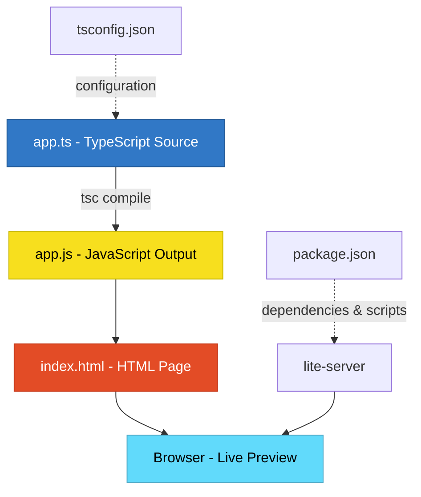

# TypeScript Learning

A simple Node.js learning project demonstrating fundamental TypeScript and ES6 features through practical examples. This project was created as part of the 'Understanding TypeScript' course by Maximilian Schwarzmüller.

Built in October 2018. A hands-on tutorial project exploring TypeScript basics including type annotations, arrow functions, destructuring, spread operators, and template literals.

## Features

- 🎯 TypeScript type annotations and type safety
- ➡️ Arrow functions with implicit returns
- 📦 Destructuring arrays and objects
- ⚙️ Default function parameters
- 🔄 Rest and spread operators
- 📝 Template literals for string interpolation
- 🌐 Live browser preview with auto-reload

## Getting Started

### Prerequisites

- Node.js (v8 or higher)
- npm or npm equivalent
- A modern web browser

### Installation

1. Clone the repository:
```bash
git clone https://github.com/orassayag/typescript-learning.git
cd typescript-learning
```

2. Install dependencies:
```bash
npm install
```

### Running the Application

Start the development server:
```bash
npm start
```

The browser will automatically open at `http://localhost:3000` with the application running. Open the browser console to see the output of the TypeScript examples.

## Project Architecture



## Project Structure

```
typescript-learning/
├── app.ts              # TypeScript source with learning examples
├── app.js              # Compiled JavaScript (auto-generated)
├── index.html          # HTML page that loads the script
├── package.json        # Project metadata and dependencies
├── tsconfig.json       # TypeScript compiler configuration
├── CONTRIBUTING.md     # Contribution guidelines
├── INSTRUCTIONS.md     # Detailed setup and usage instructions
├── LICENSE             # MIT License
└── README.md           # This file
```

## Learning Topics

The project covers the following TypeScript/ES6 concepts:

1. **Variable Declarations**
   - `let` and `const` keywords
   - Block scoping vs function scoping

2. **Arrow Functions**
   - Syntax variations
   - Implicit returns
   - Lexical `this` binding

3. **Default Parameters**
   - Setting default values for function parameters

4. **Rest & Spread Operators**
   - Collecting arguments with rest (`...args`)
   - Spreading arrays with spread (`...array`)

5. **Destructuring**
   - Array destructuring
   - Object destructuring with renaming

6. **Template Literals**
   - String interpolation
   - Multi-line strings

## Available Scripts

### Start Development Server
```bash
npm start
```
Starts `lite-server` to serve the HTML page with auto-reload on file changes.

### Run Tests
```bash
npm test
```
Note: Currently shows "Error: no test specified" - tests not implemented in this learning project.

## Configuration

### TypeScript Configuration (`tsconfig.json`)
- **target**: ES5 - Maximum browser compatibility
- **module**: CommonJS - Standard module system
- **strictNullChecks**: Enabled - Better type safety
- **noUnusedParameters**: Enabled - Catches unused parameters

### Dependencies
- **lite-server**: Development server with live reload capability

## Development

This is a learning project demonstrating TypeScript basics:

1. Edit `app.ts` to add or modify examples
2. TypeScript automatically compiles to `app.js`
3. The browser auto-reloads to show changes
4. Check browser console for output

## Contributing

Contributions are welcome! This is a learning project, so contributions could include:
- Adding new TypeScript examples
- Improving documentation
- Fixing bugs or issues
- Updating dependencies

See [CONTRIBUTING.md](CONTRIBUTING.md) for details on the code of conduct and the process for submitting pull requests.

## Author

* **Or Assayag** - *Initial work* - [orassayag](https://github.com/orassayag)
* Or Assayag <orassayag@gmail.com>
* GitHub: https://github.com/orassayag
* StackOverflow: https://stackoverflow.com/users/4442606/or-assayag?tab=profile
* LinkedIn: https://linkedin.com/in/orassayag

## License

This project is licensed under the MIT License - see the [LICENSE](LICENSE) file for details.

## Acknowledgments

- Based on the 'Understanding TypeScript' course by Maximilian Schwarzmüller
- Created as a hands-on learning exercise for TypeScript fundamentals
